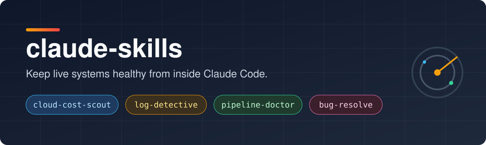
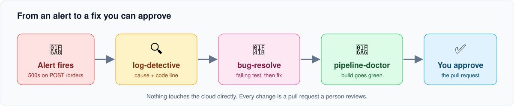
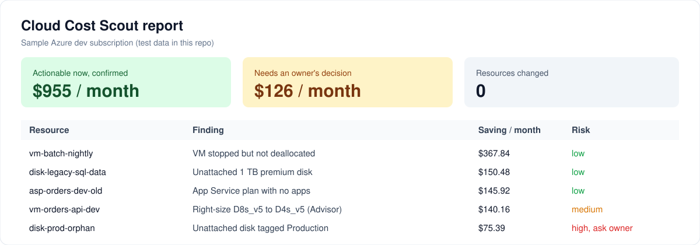
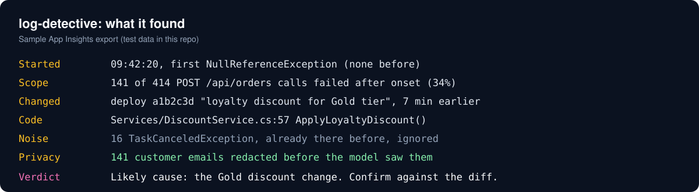
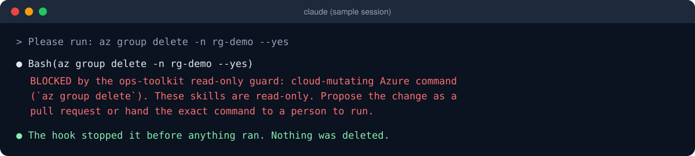

<p align="center">
  
</p>

# claude-skills

A small set of Claude Code skills for the part of the job that starts after you ship: the cloud bill creeping up, a spike of 500s at 9am, a pipeline that went red overnight, the bug report nobody wants to pick up, and the Friday update your manager wants.

| Skill | Ask it something like | What you get back |
|---|---|---|
| **cloud-cost-scout** | "Why did our Azure bill go up, and what can we save?" | What changed since last month, then a ranked list of savings: idle resources, right-sizing, switching dev and test off at night, logging costs, storage tiers, cheaper rates you may be eligible for, and spend nobody owns. Every figure says whether it's confirmed or estimated, and a helper finds where to change it in your IaC |
| **log-detective** | "POST /orders has been failing since this morning" (portal CSV exports are fine) | When it started, which errors are new, whether it's worse than a normal week, what was deployed or changed in the infrastructure just before, any platform outage, how many users and operations are affected, the code lines involved, a ready-to-review alert rule and a postmortem draft |
| **pipeline-doctor** | "Why does our build keep failing?" | The real error behind a red run, whether a failing test is flaky or a real regression (and from which commit), what keeps recurring, which steps are slow and how to speed them up, and a security and reliability review of the pipeline YAML |
| **bug-resolve** | "Fix this KeyError" | A failing test that reproduces it, the root cause, the smallest fix, proof that it works, the same bug found elsewhere in the code, and a guardrail so it can't come back |
| **ops-digest** | "Put this week together for my manager" | One page (markdown and HTML) built only from the reports above: savings, incidents, pipeline health, bugs fixed and what needs doing |
| **token-saver** | "Why is my Claude Code usage so high, and how do I cut it without losing quality?" | A report built from your own session transcripts: how big the context got on every call, which models actually ran, which agent runs inherited an expensive model, which files were read over and over, and whether your CLAUDE.md and project agents could even load. Then the fixes, applied with a backup and a dry run, and a before and after comparison a week later |

<p align="center">
  
</p>

## Install

In Claude Code:

```text
/plugin marketplace add mdmudassirahmed/claude-skills
/plugin install ops-toolkit@claude-skills
```

`ops-toolkit` gives you all five skills. If you only want one or two, install them on their own:

```text
/plugin install cloud-cost-scout@claude-skills
/plugin install log-detective@claude-skills
/plugin install pipeline-doctor@claude-skills
/plugin install bug-resolve@claude-skills
/plugin install ops-digest@claude-skills
/plugin install token-saver@claude-skills
```

`token-saver` is not in the bundle because it is about Claude Code itself rather than the systems you run; install it on its own.

Running the same install twice does nothing, so it's safe to put in a setup script. To pick up new versions, run `/plugin marketplace update claude-skills`.

**Without the plugin system:** every skill folder carries its own instructions, reference files and scripts, so you can copy one straight into your skills directory.

```bash
git clone https://github.com/mdmudassirahmed/claude-skills
cp -r claude-skills/plugins/ops-toolkit/skills/log-detective ~/.claude/skills/
```

A copied folder doesn't bring the safety hook with it. The [safety section](#staying-safe) shows how to add it.

**You'll need** Python 3.8 or newer (standard library only, nothing to install) and bash, which Claude Code already uses on Windows through Git Bash. If you want the skills to read your cloud directly rather than working from files you export, you'll also need the Azure CLI, AWS CLI or `gh`, signed in with a read-only account.

## Using the skills

Describe the problem, or name the skill:

```text
/cloud-cost-scout  Two months of exports are in ./cost-scout-input. Why did the bill go up, and what can we save?
/log-detective     POST /api/orders returns 500 since 09:40. Logs and the Activity Log are in ./incident-logs,
                   last week's logs are in ./baseline-logs. Include an alert and a postmortem draft.
/pipeline-doctor   The build keeps going red. Runs are in ./ci/runs.json, failed logs in ./ci/logs.
/bug-resolve       KeyError: 'currency' in pricing/convert.py for markets without a currency.
/ops-digest        Put this week's reports in ./digest-input together for my manager.
/token-saver       Why is my Claude Code usage so high this week? Measure it, then show me what to change.
```

Green pipelines are worth a look too: ask pipeline-doctor for a "health check" and it reviews step timings and the pipeline YAML.

If you don't have the data yet, each skill gives you the exact read-only commands to export it from the Azure CLI, the AWS CLI or the portal.

Here's what the cost scan looks like on the sample subscription that ships with the tests:

<p align="center">
  
</p>

And log-detective working through a sample incident:

<p align="center">
  
</p>

The headline number only counts savings that are confirmed (from Azure Advisor, AWS Compute Optimizer or your actual bill) and low enough risk to act on. Anything tagged as production or legal hold is listed separately for its owner to decide on.

## Staying safe

None of these skills change a cloud resource, a pipeline setting or a secret. When something needs fixing, you get a pull request or a note to send to whoever owns it.

<p align="center">
  
</p>

There are four layers to that:

1. **Use a read-only account.** This is the one that really matters. In Azure that's Reader, Monitoring Reader, Log Analytics Reader and Cost Management Reader. In AWS, ViewOnlyAccess plus read access to CloudWatch Logs and Cost Explorer. An account that can't write can't do damage, whatever the AI tries.
2. **The guard hook.** The cloud-facing plugins include a hook that stops commands which change resources or read secrets before they run. It covers `az`, `aws`, `gcloud`, `kubectl`, `terraform`/`tofu`, `helm`, `pulumi`, the Az and AWS PowerShell modules and direct calls to management APIs, including when they're wrapped in `bash -c`, `pwsh -Command` or `eval`. Reads like `list`, `show`, `query` and `describe` go through. It can't catch a custom script or SDK call, which is why the first point matters.
   - If a person really does need to allow a change, start Claude Code with `OPS_TOOLKIT_ALLOW_CLOUD_WRITES=1`.
   - For a manually copied skill, add the hook to `~/.claude/settings.json`:
     ```json
     { "hooks": { "PreToolUse": [ { "matcher": "Bash|PowerShell", "hooks": [
       { "type": "command", "command": "bash \"/path/to/claude-skills/plugins/ops-toolkit/hooks/cloud-readonly-guard.sh\"" } ] } ] } }
     ```
3. **Logs get cleaned first.** Before the model sees a log, secrets (tokens, keys, connection-string passwords, SAS signatures and so on) and personal details (emails, IP addresses, card numbers, phone numbers) are swapped for placeholders. The same email always gets the same placeholder, so you can still follow one user through the logs. It won't spot names or other free text, so think before you share sensitive logs.
4. **Start with files.** You can export data yourself and hand over the files, with no access needed at all. That's the right choice for anything sensitive. Only point these skills at someone else's environment with their permission.

## Tried for real

Besides the unit tests, I ran each skill headless in Claude Code against the sample data:

| What I asked | What happened |
|---|---|
| Run `az group delete` | The hook blocked it and explained why. Nothing ran. |
| Scan the sample Azure subscription | $955 a month of confirmed, low-risk savings, with the production and legal-hold items kept apart. It also spotted that one reservation suggestion overlapped with a resize. |
| Diagnose the sample NullReferenceException incident | Found the 09:42 start, the deploy seven minutes earlier, `DiscountService.cs:57`, and that every failure was a Gold-tier customer. It called the cause "likely" rather than confirmed because it couldn't see the source. No customer email appeared anywhere in the session. |
| Explain a failed deploy | Expired service-connection secret, sent to the pipeline admin, with the permanent fix (workload identity federation) and a check that nothing leaked in the log. |
| Fix a KeyError in a small Python repo | Made a branch, wrote a test that failed with the same error, fixed one line based on the rule in the README, and got 3 of 3 tests passing. It pointed out a related gap but didn't guess a business rule for it. |

And again for 1.1, with the new features:

| What I asked | What happened |
|---|---|
| Why did the bill go up, and what can we save? (two months of exports) | Run rate up $851 a month (+95%), traced to a new untagged scale set and a VM that was stopped but still billed. $608 a month confirmed saving, 70% of spend with no owner, and a clear list of which extra exports would price the rest. It pointed out that one VM's size didn't match its cost instead of glossing over it. |
| Payments failing, with the Activity Log and last week's logs | Confirmed cause: an app-settings change two minutes earlier pointed the gateway at a host that doesn't resolve, and a second change 51 minutes later fixed it. It ruled out the deploy, a network change and background noise, and wrote the postmortem draft. |
| Which CI failures are flaky and which are real? | One real regression on main with the first bad commit, one flaky test, and a recurring package-feed permission problem for the pipeline admin, in the order to tackle them. |
| Fix the KeyError and look for the same bug elsewhere | Fixed with before and after proof checked by the report script, found the same pattern in `tax.py` and left it for a product decision, and suggested a type-checker rule to stop it coming back. |
| Put the week together for my manager | A one-page summary with owners for each action, and a list of what the reports don't cover. |

These runs also caught three bugs that the unit tests had missed, all fixed before release, each with a test so it can't come back:
- the log cleaner missed an API key inside an escaped JSON request body in the Activity Log;
- the suggested alert counted background errors of the same type, so its threshold was too high to fire;
- the digest showed the month-on-month bill change as "n/a".

## Cutting the Claude Code bill

`token-saver` is the odd one out: it looks at Claude Code itself. Every session is already logged to `~/.claude/projects/` as JSONL with the token counts of every call, so the skill reads those files and reports where the spend went: how large the context was on each call and what a cap would have saved, which models ran, how many agent runs inherited the parent's expensive model because no `model:` was pinned, which files were read whole again and again, and whether sessions were started from a folder where the project's CLAUDE.md and agents could load at all.

The fixes are structural, not stylistic: an auto-compact cap with a hook that re-injects exact state from disk after every compaction, a read guard that turns whole-file reads of large files into slices, tiered agents, and rules for bounded tasks and short hand-backs. `apply.py --dry-run` shows the settings change first, backs up before writing, and `scaffold <repo>` adds the repo side. Save a `--json` snapshot on day one and run `--compare` a week later to see the real before and after. Nothing leaves the machine, and nothing is committed or deleted.

## How the repo is organised

- `src/` holds the skills, the shared redaction code and the hook. That's where changes go.
- `python tools/build.py` turns `src/` into the installable plugins under `plugins/` and writes the marketplace file. It only touches files that changed, so running it again does nothing, and `--check` fails if `plugins/` is out of date.
- The scripts do the mechanical work (reading exports, grouping errors, adding up costs). The skill instructions tell Claude how to reason about the results and report them honestly. Give the scripts the same input and you get exactly the same report.

## Running the tests

```bash
python -m pip install pytest pyyaml
python -m pytest tests -q
```

There are nearly 400 tests. They cover the guard against close to 200 real commands, the log cleaning, a dozen sample incidents (including infrastructure changes, platform outages and baseline comparisons), failed pipeline logs for about sixty known causes, run histories with flaky tests and regressions, pipeline YAML with good and bad patterns, two-month cost exports and optimisation data for Azure and AWS, bug patterns in six languages, the digest, installing each skill on its own, repeat runs, and the plugin manifests. CI runs them on Linux and Windows with Python 3.8 and 3.12. All the sample data is made up.

## Where this is going

See [ROADMAP.md](ROADMAP.md): scheduled runs with a read-only identity, architecture diagrams from IaC, design-versus-reality checks and security posture are next.

## Contributing

Seen a pipeline failure that pipeline-doctor doesn't know about? Add it to `src/skills/pipeline-doctor/references/failure-signatures.json` with a sample log in `tests/fixtures/pipelines/`. For anything else, edit `src/`, run `python tools/build.py`, and run the tests.

## Licence

MIT. See [LICENSE](LICENSE).
